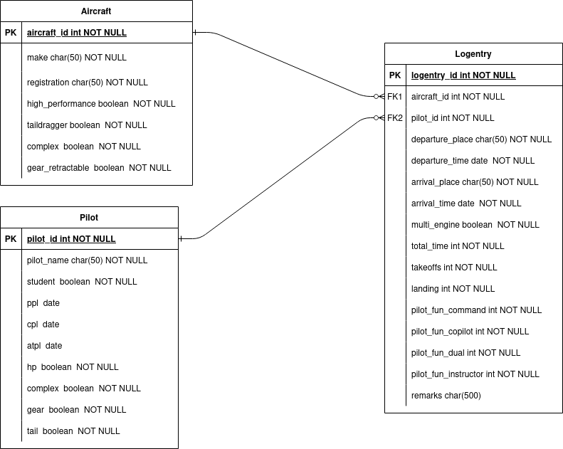

# DigiLogbook

**DigiLogbook** is a digital pilot logbook application built with PHP and Docker. It provides a range of functionalities for managing pilot records and logbook entries.

## Features

- **User Registration**: Allows users to create accounts with secure passwords.
- **User Login and Authentication**: Enables secure login for registered users.
- **Pilot Dashboard**: Displays information about certifications and endorsements.
- **Logbook Functionality**: Manage logbook entries, including adding, modifying, and removing entries.

## Database Schema

For a detailed view of the database structure, see the following diagram:



## Getting Started

### Prerequisites

Ensure you have Docker and Docker Compose installed on your machine.

### Running the Application

1. **Start the services**:

   ```bash
   docker compose up -d
    ```

2. **Access the Application**:
Open your web browser and go to <http://localhost:8080>. Please wait a few seconds for MySQL to initialize before accessing the site.

3. **Stop the services**:
When you're done, you can stop and remove the containers with:

   ```bash
    docker compose down
    ```

Pre-Built Accounts

Here are a few pre-built accounts for testing:

    Alice Smith: securepassword1
    Bob Johnson: securepassword2
    Charlie Brown: securepassword3

Feel free to use these credentials to test the functionality of the application.
